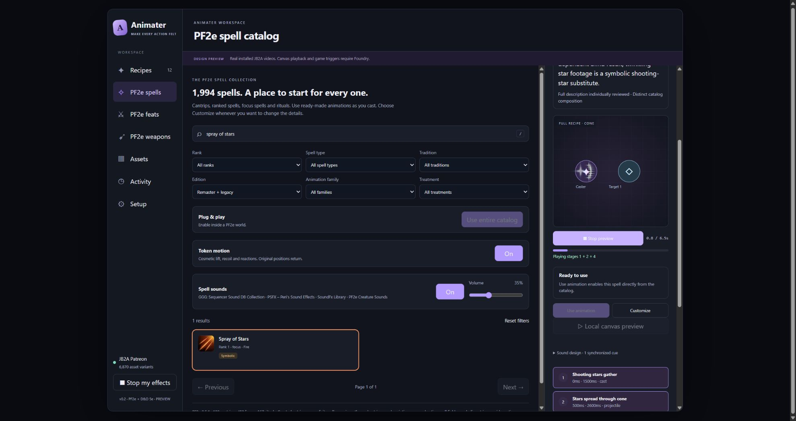

# Deep PF2e catalog audit — 2026-10-07

This pass audited and repaired animation semantics, native JB2A selection, visible scale and timing, token motion, and optional sound across the complete existing catalogs. Final automated suite: **381 passing tests**. Final catalog, spell, feat/motion, media-duration and sound audits report **zero blocking issues**. Eight alpha-peak flags remain deliberately authored formation/contraction effects, explained below.

## Scope and evidence

| Catalog | Complete inventory checked | Additional individual full-description review this pass |
| --- | ---: | --- |
| Spells | 1,994 | 111 newly directed spells, including the entire former 66-spell utility cluster |
| Active feats | 2,308 | 175 descriptions; all 137 previously stationary movement/flight candidates classified |
| Weapons | 1,013 documents / 1,122 Strike uses | Suspect construction, material, bomb and returning-weapon descriptions; complete inventory parsed and hashed |
| Optional sounds | All three catalogs | All 66 utility descriptions plus Spray of Stars individually read; weapon/ability suspects reviewed separately |

The primary source is native [PF2e 8.5.1, commit 563fd527](https://github.com/foundryvtt/pf2e/tree/563fd52708673ddd4f66c76921efbf6a938fffed). Description hashes, native fields, rationales and exact media decisions are retained per entry. Three independent agents owned spells, feats/shared motion, and weapons/sounds; the main pass checked shared planning, area rendering, media, integration and browser behavior.

Programmatic full-description coverage is distinct from individual reading. This is not a claim that every animation was watched in Foundry or every sound was listened to. The weapon catalog includes bombs and supported melee/ranged/thrown/combination Strike uses. Standalone non-weapon consumable/equipment activations are not an existing catalog and are not counted as audited animations here. Passive feats remain excluded.

The full [cross-catalog ledger](../data/deep-catalog-audit-2026-10-07.json) checks every recipe in both JB2A inventories with one and three targets, appropriate native area shapes and installed audio-provider alternatives. The [spell evidence](deep-spell-audit-2026-10-07.json), [feat/motion evidence](../data/deep-feat-motion-audit-2026-10-07.json) and [weapon/sound evidence](../data/deep-weapon-sound-audit.json) add source-level classifications and specialized checks.

## Animation and variant changes

- Native cones use directional area footage instead of small radial effects. Cylinders, cubes/squares and emanations retain their native two-dimensional footprint; caster support remains local. Life-Draining Roots damages the line and separately returns nutrients to the caster.
- Spray of Stars now launches seven small star films across the native cone, followed by a faint dazzling fan. A reusable cone-fan control exposes flight count. It no longer shares a fire-breath recipe with Breathe Fire. Star artwork remains an explicitly symbolic substitute.
- The former 66-spell utility cluster now distinguishes rope response, blindness, load-bearing support, psychic impressions, shared sight, pocket transitions, retrieval, scent, object transformation and companion care. These illustrations do not enact later commands, alarms, returns or save outcomes at cast time.
- Paralysis, confusion, sleep and compelled dance have different treatments. Covert manipulation and mental defense no longer share inappropriate on-token growth. Native floor cracks keep their visible footprint; pressure/growth can animate a separate token copy.
- Double Shot and Hunted Shot use ranged flight and contact rather than paired melee slashes. Contact selection distinguishes claws, fists, thrusts, broad cuts and heavy weapons. Native matching fire/cold footage preserves its own highlights.
- Katana, shield, sickle/scythe, mace, butterfly sword, claw and short-blade construction use fitting available families. Piercing damage alone no longer turns a shortsword into a rapier. Permanent elemental melee and arrow/bolt footage is considered before neutral footage.
- Bomb payloads distinguish acid, frost, electricity, spores, foam/hardening debris, silver filings, water, thorns, pressure and fragmentation. Acid Flask retains localized splash and residue on the target. Optional activations and critical-only riders are not assumed on every Strike.

Installed Patreon **0.8.1** and official Free database were searched in full: 6,870 and 1,351 keys. Sequencer **4.2.3** was inspected for actual sizing and portable area-mask support. Inventory hashes are stored in the ledger; Free is a current fetched reference, not a locally installed pack.

| Selection across all catalogs | Patreon | Free |
| --- | ---: | ---: |
| Selected database keys | 528 | 292 |
| Selected random/distance video paths | 1,040 | 574 |
| Selected JB2A families | 148 | 147 |
| Spell keys / families | 325 / 121 | 208 / 120 |
| Feat keys / families | 278 / 81 | 162 / 87 |
| Weapon-use keys / families | 94 / 50 | 64 / 44 |

Selection counts are not quotas. Many database keys are color, distance or numeric alternatives of the same effect. Geometry and spell/weapon meaning outrank using an otherwise unsuitable variant. All registered assets remain available in the editor. Native color tokens used by spells number 34 Patreon / 31 Free; feats 32 / 25; weapons 13 / 11. Color substitutions remain approximations where an edition lacks matching footage.

## Motion and pacing

The complete shared-motion audit covers 1,994 spells, 2,308 feats and all 1,122 weapon modes. Feat plans include both editions and near, far and no-target contexts: **13,848 plans**. Motion sampling checks finite poses, travel bounds and exact neutral endings.

The movement-description review added **111 traversal profiles**; 26 candidates intentionally remain stationary grants, choices or area cues. Sprinting, rolling, leaping, retreats, swimming, gliding, dives, forced throws and parallel ally travel use fitting cosmetic paths. Short Fly actions differ from acquiring a flight speed. Actual actor/companion and legal route selection remain manual where native events cannot identify them.

Path heading now supports toward/away and four map directions. This is map direction, not altitude. Compound paths and contacts follow arrival timing. Hopping Stride uses a readable 2,200 ms low arc. Repeated Steps/hops now start after the prior path completes; obsolete 200 ms intervals had overlapped whole routes. Outbound/return pacing avoids the previous abrupt fast return.

Same-recipe motions compose on one baseline instead of canceling unfinished gestures. Different playback owners still isolate cancellation; stopping one user cannot stop a similarly named user. Texture/source changes cancel safely without restoring stale geometry. The editor uses the same composition semantics. Token documents, positions, actions, HP and conditions are never changed by these poses.

Current default recipe coverage: **662 spell recipes / 675 motion stages**, **950 feat recipes / 1,073 motion stages**, and all **1,122 weapon uses**. Counts describe configured cues, not mechanically faithful traversals of every legal path.

## Scale, duration and visibility

The editor and canvas compiler share measured transparent-padding correction. **850 local-art filenames** have visible-alpha bounds; native aspect and token footprint remain intact. Cone previews preserve vertex, direction, reach and aperture and fit narrow panels. Native canvas cone clipping uses portable polygons rather than temporary document UUIDs.

Complete media probes cover **820 selected edition keys / 1,252 distinct probed files**: zero missing measurements, zero cutoffs, zero early exit fades. All **1,040 selected Patreon paths** exist at their exact installed locations. The **574 Free paths** are reference-measured; the Free pack is not installed here. Random and distance variants are included; a representative short file cannot silently bound a longer variant.

Decoded-alpha activity covers **1,614 edition-specific paths**. Initial pass found 295 recipe/file peaks attenuated by inappropriate entrances. Final pass retains eight deliberate rows: Day's Weight and Siege Weapon's Blessing form sustained runes; Runic Body develops glowing runes; Void Warp deliberately contracts life-force strands. The [spell report](deep-spell-audit-2026-10-07.md) records exact timings and rationale. These flags are not hidden or removed from the machine report. Short baked strikes remain fast contact events; a short active interval alone does not justify slowing every film.

See [duration evidence](../data/pf2e-media-completeness-after.json) and [alpha activity evidence](../data/media-visibility-audit-after.json).

## Sound meanings and variety

| Catalog | Recipes with sound | Intentionally quiet | Profiles used | Actual selected audio files |
| --- | ---: | ---: | ---: | ---: |
| Spells | 881 | 1,113 | 63 | 79 |
| Active feats | 687 | 1,621 | 29 | 98 |
| Weapon uses | 1,122 | 0 | 92 | 199 |

Provider alternatives retain up to six fitting variations per cue. Exact files from installed GGG 0.2.1, PSFX 0.18.0, SoundFx Library 1.0.3 and PF2e Creature Sounds 2.0.0 are checked independently and together. Missing providers stay quiet. Sound-manager modules are not treated as asset libraries.

Physical contact sounds no longer stack once per elemental layer. Bomb audio follows the actual payload landing stage; repeated missiles inherit visual cadence. Lightning Storm thunder follows its strike. Magical and physical shield profiles coexist. Future-healing enhancement does not play immediate healing; reinforcement of an existing summoned ally does not play a new arrival. Retrieving Hook uses a neutral object-flight cue, Pet Cache a pocket departure, and Spray of Stars a quiet shimmer at its **500 ms** projectile release. Other subtle utility effects keep explicit quiet reasons.

All **483 retained candidate audio files** resolve and probe as playable; none are missing. Mean levels span -32.9 to -11.8 dB, so automatic volume stays user controlled. Eighty-nine clips exceed 4.5 seconds and are capped for automatic cues. File names, levels and durations do not prove artistic timbre or identical perceived loudness. No audio/media are redistributed.

## Similarity retained honestly

The cross-catalog ledger separates exact configuration identity, coarse visible configuration and family/topology similarity. Its visible metric includes real files, roles, routing, repetitions, quantized timing/scale/color, offsets, entrances, property tracks and motion heading. IDs, labels and sound cannot manufacture visual uniqueness. Separate structural counts ignore decorative framing and color entirely.

| Catalog | Coarse visible configurations, Patreon / Free | Conservative structural compositions |
| --- | ---: | ---: |
| Spells | 1,105 / 1,113 | 699 |
| Active feats | 2,285 / 2,254 | 566 |
| Weapon uses | 208 / 193 | 166 |

These are configuration counts, not counts of bespoke cinematic animations. Exact feat configurations can differ visibly while sharing the same basic attack or support structure. Related weapon tiers and the same base construction intentionally share Strikes: the largest staff group has 169 uses. The remaining largest coarse spell group contains 40 Patreon / 39 Free entries. **930 nonritual generic spell motifs remain** in the semantic report; complex utility and unavailable literal artwork remain a real customization backlog. The entire remaining groups, names and per-entry decisions are exposed instead of hidden by recolors.

## Rendered verification and practical limits

An isolated browser preview used actual installed Patreon films. Rendered checks covered a full Breathe Fire cone without panel cropping, seven separated star flights and step highlighting, Acid Flask target splash/fragment/residue decoding, and readable hopping/ranged-feat composition. Console/media failures were checked. The QA origin and temporary server are separate from the user's workspace preview; world settings were not changed.



Native compile/hook tests cover placed PF2e cones, lines and circles, private area cleanup, asset geometry, arrival links, local motion restoration and sound timing. A logged-in live Foundry canvas and multiplayer session were unavailable during this pass; this is not presented as live-client verification. D&D 5e behavior is covered by existing adapters/tests, not by this PF2e content audit.

Remaining limitations include manually selected actor/companion/object stand-ins, arbitrary wall or multishape paths, three-dimensional volume, player-selected branches, heightened geometry/counts and later Sustain/reaction effects. Cosmetic approach/contact alignment does not prove exact baked blade-contact frames. See the specialized [spell](deep-spell-audit-2026-10-07.md), [feat/motion](deep-feat-motion-audit-2026-10-07.md), [weapon/sound](deep-weapon-sound-audit-2026-10-07.md) and [utility sound](deep-utility-sound-audit-2026-10-07.md) reports.

## Reproduce

After modifying source designs, rebuild spell and feat catalogs, then spell/ability sounds. For media-duration changes, write durations and rerun in a fresh process so imported duration metadata is current.

```powershell
rtk proxy node tools/build-pf2e-catalog.mjs --reuse-media
rtk proxy node tools/build-pf2e-feat-catalog.mjs --reuse-media
rtk proxy node tools/build-spell-sounds.mjs
rtk proxy node tools/build-ability-sounds.mjs
rtk proxy node tools/audit-media-completeness.mjs --write-durations --fetch-missing-free
rtk proxy node tools/audit-media-completeness.mjs --fetch-missing-free
rtk proxy node tools/audit-media-footprints.mjs --fetch-missing-free --write
rtk proxy node tools/audit-media-visibility.mjs --fetch-missing-free
rtk proxy node tools/audit-deep-spells.mjs
rtk proxy node tools/audit-deep-feat-motion.mjs
rtk proxy node tools/audit-catalog-depth.mjs
rtk proxy node tools/audit-weapon-sounds.mjs --probe-audio
rtk proxy node --test tests/*.test.mjs
```
