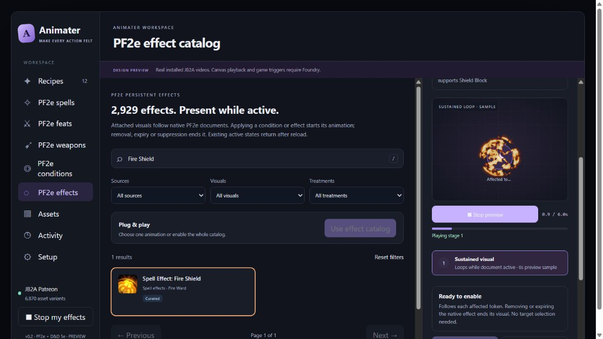
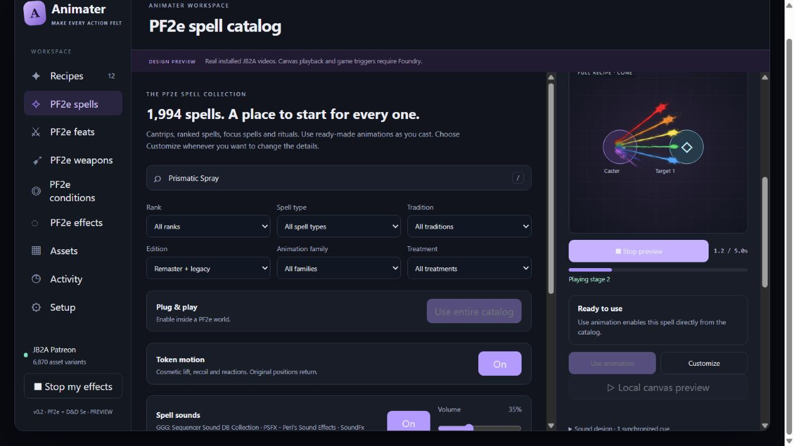

# Full animation and sound audit — 2026-10-07

Audited every shipped built-in recipe across both JB2A editions. Corrected native action semantics, asset selection, routing, motion/contact timing, persistent presentation, sound matching and playback cancellation. Final suite: **467/467 tests pass**, with zero missing selected-media measurements, measured early movie cutoffs or unintended entrance suppression under the documented checks.

Three specialist subagents reviewed spells, feats/weapons/motion, and sound. The coordinating pass covered shared playback, all eight catalog domains, persistent descriptions/rules, media duration, alpha/footprints, rendering, and integration regressions. Whole-catalog automated coverage and individually read descriptions are recorded separately below. This report does not claim that every animation was watched or every recording heard.

## Coverage and source

| Shipped domain | Recipe/use rows |
| --- | ---: |
| PF2e spells | 1,994 |
| Active PF2e feats | 2,308 |
| Weapon uses: melee, ranged, thrown, combination modes | 1,122 from 1,013 documents |
| PF2e conditions | 43 |
| Persistent spell/item/feat and other native effects | 2,929 |
| Persistent damage variants | 11 |
| Starter recipes | 12 |
| Chromatic Orb element variants | 6 |
| **Total** | **8,425** |

Native descriptions and rules use PF2e **8.5.1**, pinned commit `563fd52708673ddd4f66c76921efbf6a938fffed`. Primary sources: [spells](https://github.com/foundryvtt/pf2e/tree/563fd52708673ddd4f66c76921efbf6a938fffed/packs/pf2e/spells), [feats](https://github.com/foundryvtt/pf2e/tree/563fd52708673ddd4f66c76921efbf6a938fffed/packs/pf2e/feats), [equipment](https://github.com/foundryvtt/pf2e/tree/563fd52708673ddd4f66c76921efbf6a938fffed/packs/pf2e/equipment), and [condition/effect packs](https://github.com/foundryvtt/pf2e/tree/563fd52708673ddd4f66c76921efbf6a938fffed/packs/pf2e). Per-entry provenance and description hashes remain in the generated catalogs and review ledgers.

All rows receive automated recipe/media/topology checks. This pass individually consulted complete native descriptions for **87 spells, 163 feats, 178 weapons**, plus **170 persistent-effect names** across two suspect queues. The state manifest discloses the empty Kharna's Blessing description and the native modifier reviewed instead. Weapon readings include all 171 bomb entries/grades. Prior review counts overlap and are not added to these totals. Full-read manifests retain unchanged decisions as well as corrections.

Standalone activation coverage for every nonweapon PF2e equipment item is outside the shipped catalogs. Their native persistent item effects are included. Saved user recipes are preserved; updated catalog defaults do not rewrite customized world data.

## Concrete corrections

| Area | Failure found | Final behavior |
| --- | --- | --- |
| Rays and fans | Cone ray intent could select object volleys; prism colors shared one neutral beam | Dedicated ray fan geometry, cone vertex/aperture/endpoints, per-lane colors; seven rays for the reviewed prismatic treatments |
| Material selection | A reviewed rust cloud could fall back to dagger-cloud footage; square rolling objects inherited projectile constraints | Material-compatible candidates prioritized within legal geometry; particles for rust, radial object classification for rolling boulders |
| Spell action semantics | Creation, weapon buffs and later outcomes could be portrayed as immediate attacks | Fire Seeds forms acorns; Draconic Barrage forms its orbit; Funeral Flames coats the weapon; Echoing Weapon defers its attack cue; Heat Metal marks a red surface |
| Spell travel | Remote origin, returns and movement could use the caller/first target incorrectly | Explicit first-target origin and second/third target roles; absent requested targets skip; target caps apply before positional selection; true flying-weapon and star-projectile arrival cues |
| Feat attack counts | Paired firearm, shield, unarmed and multi-victim activities shared incorrect weapon/count topology | Two same-foe ranged contacts for Paired Shots/Twin Shot Knockdown; one Everstand shield Strike; three same-foe unarmed contacts for Cross the Final Horizon; four different foes for Anatomical Quartering |
| Feat consequences | Chain Reaction could appear as four travelling bullets; Clear the Way as weapon hits | One bullet plus subsequent consequence cues; Shoves followed by Stride without invented weapon Strikes |
| Charge/leap motion | Fast travel and mismatched contact timing could let artwork return before the hit | Distance-paced rush/leap paths, contact holds and restored poses; Sudden Charge/Sudden Leap and related graphs checked across near/far placements |
| Actual performers | Caller token could stand in for a thrall, eidolon, companion, mount, construct or historical victim | 47 explicit native role records; unresolved automatic playback skips with an Activity explanation; manual preview/customization remains available |
| Weapon payloads | Distinct bomb materials and native bleed riders could lose their target treatment | Silver particles, crossfire, red powder, crystal fragments, radioactive particles and eddies where described; Wounding/Splintering Spear/Macuahuitl retain their finite bleed residue |
| Successful hit effects | Cane of the Maelstrom's Warpwave could play without a confirmed successful Strike | Shared success-only stage gate; failed/unknown automatic attacks omit the branch; previews illustrate success |
| Persistent polarity | Resistance looked like inflicted damage; Speed penalties looked like haste; “until healed” looked restorative | Defensive shields, constrained-movement borders/bindings and penalty runes; selectable benefits remain neutral; literal emitted light is retained |
| Persistent size/alpha | One generic scale/opacity treated markers, shields, bindings and haze alike | Selected asset role determines footprint, opacity, layering and token-relative marker offset, including edition fallbacks |
| Starter completeness | 13 early movie cutoffs, one early fade, four radial melee effects stretched into travel footage | Full one-shot media lifetimes, localized blade artwork, measured contact links and motion holds |
| Audio semantics | Blowguns matched gunfire; preparation/music/privacy text created public sounds; metal buffs sounded like anvil impacts | Native weapon choices and negation respected; quiet/private/preparatory actions stay quiet; missile releases, resonant notes and chain cues use appropriate families |
| Audio levels and repeats | Loud clips and long tails accumulated across rapid contacts | Measured attenuation, distinct vetted paired-contact recordings and finite repeat tails; original pitch/sample rate preserved |
| Missile audio opening | PSFX release windows could play mostly silence | Measured 300 ms opening skip on known PSFX missile files; fallback replaces provider opening while retaining additional user trim |
| Stop/load and clip range | Uncached sound could start after Stop; explicit sound ranges could retain an overlong duration/deadline | Preload selected files through public APIs before timeline start; cancellation epoch checks and late-session cleanup; compile duration to the explicit sound window |

Detailed descriptions, branch boundaries and actual selections: [spell audit](full-spell-audit-2026-10-07.md), [feat/weapon/motion audit](full-feat-weapon-audit-2026-10-07.md), [sound audit](full-sound-audit-2026-10-07.md), [persistent review manifest](full-state-review-2026-10-07.json).

## JB2A inventory, variants and reuse

Selection searches the full inventories, then applies role, material and geometry constraints. The audit counts actual selected keys and all their random/distance video variants; inventory size is not a promise to use every color/distance alias. JB2A Free source: [official database](https://github.com/Jules-Bens-Aa/JB2A_DnD5e/blob/main/scripts/jb2a_sequencer.js). Patreon source is the installed 0.8.1 database; Sequencer is installed 4.2.3. Inventory hashes are recorded in the [whole-catalog ledger](../data/full-catalog-audit-2026-10-07.json).

| Edition | Inventory keys searched | Selected keys | Selected variant files | Selected families |
| --- | ---: | ---: | ---: | ---: |
| Patreon | 6,870 | 779 | 1,321 | 151 |
| Free | 1,351 | 389 | 673 | 151 |

Reuse checks ignore labels, IDs, sounds and tiny timing/scale differences. Meaningful signatures include topology, actual files, medium-scale colors/framing/tracks, motion and entrances. A coarser family signature removes color and replaces files with family/geometry. Both retain the shared groups in the ledger rather than concealing them behind unique IDs.

| Domain | Meaningful configurations, Patreon | Meaningful configurations, Free | Rows |
| --- | ---: | ---: | ---: |
| Spells | 1,140 | 1,146 | 1,994 |
| Feats | 2,285 | 2,254 | 2,308 |
| Weapon uses | 217 | 202 | 1,122 |
| Conditions | 37 | 31 | 43 |
| Persistent effects | 230 | 101 | 2,929 |

These are configuration measurements, not a count of bespoke artwork or proof of perceptual uniqueness. Weapon grades correctly share attacks; statistical effects share markers; Free substitutions can reduce material/color identity. **867 nonritual spells retain generic motifs.** Similar compositions remain explicitly documented. No claim that all 8,425 entries are individually designed or artistically unique.

## Timing, motion, scale and visibility evidence

The [media completeness audit](../data/pf2e-media-completeness-after.json) covers all eight domains and both editions: **1,168 selected media keys/edition records, 1,543 resolved physical files probed**, zero missing measurements, zero measured early cutoffs, zero early fades. All **1,321 Patreon paths exist locally**. JB2A Free is not installed; all **673 Free variant paths** are measured using matching official/reference media, not asserted to exist in the local Free module.

The [footprint audit](../data/media-footprint-audit.json) covers **1,483 selected localized-artwork files**, with **1,116 measured profiles**, 958 installed and 525 reference file records, zero missing measurements. Decoded alpha bounds retain aspect ratio/center and compensate transparent padding; token footprints and native templates determine scene scale. Beams retain their own geometry rather than treating the whole rectangular movie as a circular aura.

The [visibility audit](../data/media-visibility-audit-after.json) covers **1,994 selected variant files**. Integrated alpha at 24 fps/64 px samples active footage and authored entrances. All frames within 95% of peak are considered for suspect clips. Final result: **zero unintended entrance-suppression flags**. The ledger retains **55 authored shape/entrance changes** (formation, contraction or crossed silhouettes) and **516 naturally brief physical slash/unarmed/impact stage records**. A short contact movie is not evidence of accelerated token travel; sharp native strikes are retained rather than artificially slowed wholesale.

Feat/weapon sampling builds **20,580 edition/context plans**, evaluates **13,908 motion instances at 201 samples each**, and checks finite transforms, pose reset, overlap and contact holds. Zero defined graph/motion issues remain. Fastest reviewed translation is Sudden Leap at 11.212 squares/second over its distant 4.56-second illustration; old abrupt 39-square/second spikes are absent. These are cosmetic mesh paths, not changes to TokenDocument position or enforced PF2e movement rules.

Browser QA verified regenerated defaults, a seven-lane prismatic fan and persistent playback using real installed Patreon footage in the standalone workspace. Fire Shield surrounds its token at the configured shield scale, with the active step highlighted:





This verifies the editor renderer. Native Foundry canvas and multiplayer visual/audio playback were not independently exercised live in this final pass; integration tests use native-shaped hook/API fixtures.

## Sound inventory and measured results

The sound audit evaluates **5,424 action rows** across six configurations: no provider, each of four providers alone, and all together. These are not all 16 possible subsets. Supported installed media sources: GGG 0.2.1, PSFX 0.18.0, SoundFx Library 1.0.3, PF2e Creature Sounds 2.0.0. Manager-only modules without an audio library do not supply invented cues. Source links and per-provider coverage appear in the [sound report](full-sound-audit-2026-10-07.md).

| Domain | Rows with suitable optional cues | Actual selected files with all providers |
| --- | ---: | ---: |
| Spells | 896 | 83 |
| Feats | 685 | 99 |
| Weapon uses | 1,122 | 199 |

All **496 retained candidate files**, including provider fallbacks, were decoded and SHA256 hashed: zero missing paths, unresolved active references, decode failures or generated measurement discrepancies. **382 clips attenuated; 114 quiet clips left unboosted.** Effective whole-file mean ranges from -34.8 to -20.0 dBFS, maximum effective peak -3.0 dBFS before user volume. These are FFmpeg whole-file mean/peak measurements, not LUFS mastering or a global limiter; simultaneous layers can still sum. Ninety-five native files exceed 4.5 seconds and retain the finite automatic cue cap.

All **2,972 persistent conditions/effects** and persistent-damage loops stay quiet. Refresh/value changes, reload or scene entry do not create recurring attack audio. Ambiguous/private/player-chosen performances remain quiet. Original sample pitch is preserved; variety comes from actual recordings and native cue phases. All 496 files were measured, not individually heard. [File evidence](full-sound-file-audit-2026-10-07.json) and [waveform evidence](full-sound-waveform-2026-10-07.json) state those limits.

Public Sequencer sound/preload behavior was checked against installed source and [official sound API](https://fantasycomputer.works/FoundryVTT-Sequencer/#/api/sound). Local loading uses `preload(files, false)`; table loading uses `preloadForClients(files, false)`. Decoder checks establish usable files; a preload response alone does not establish a successful decode.

## Final validation and remaining work

**467 tests passed; zero failures, skips or cancellations.** Focused sound tests pass 53/53; expanded feat/weapon/motion checks pass 70/70. These focused counts are subsets of the broad suite and are not added to 467. The whole-catalog ledger has 16,850 edition records and zero defined provenance/selection/geometry issues. [Final validation and artifact hashes](full-audit-validation-2026-10-07.json) preserve test-log identity and the coordinated source/report snapshot.

Full automated coverage is complete for the shipped scope. Remaining artistic and runtime limits are explicit: generic/shared treatments, reference-only Free verification, unlistened recordings, and unverified live multiplayer. **47 native performer/history-dependent feats require manual token selection**; automatic resolution of eidolons, thralls, multiple performers and historical victims remains unimplemented. Manual one-source illustrations cannot represent every two-performer activity faithfully.

Reproduce broad checks from the Animater module directory:

```powershell
rtk proxy node --test tests/*.test.mjs
rtk proxy node tools/audit-catalog-depth.mjs --full
rtk proxy node tools/audit-media-completeness.mjs --fetch-missing-free --write-durations
rtk proxy node tools/audit-media-footprints.mjs --fetch-missing-free --write
rtk proxy node tools/audit-media-visibility.mjs --fetch-missing-free
rtk proxy node tools/audit-deep-spells.mjs
rtk proxy node tools/feat-weapon-deep-audit.mjs
rtk proxy node tools/audit-sound-files.mjs
```

Media probes require FFmpeg and the listed source/provider versions. Generated measurements identify those source bytes; changing an installed library warrants regeneration. The specialized reports record additional selector, description and provider-fallback regressions.
