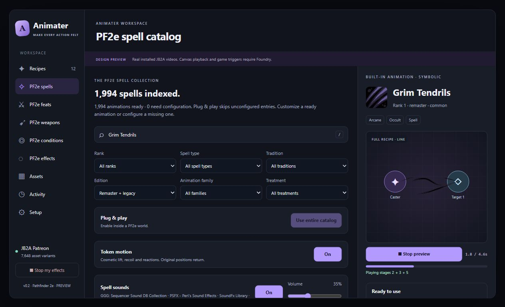

# Grim Tendrils review

Reviewed the full [native PF2e description](https://raw.githubusercontent.com/foundryvtt/pf2e/563fd52708673ddd4f66c76921efbf6a938fffed/packs/pf2e/spells/spells/rank-1/grim-tendrils.json): curling darkness leaves the caster's fingertips and travels through a 30-foot line. Fortitude outcomes determine damage and persistent bleed.

The previous Patreon choice, `energy_strands.range.multiple.dark_greenpurple.02`, uses a 0.733-second representative clip. Browser playback showed a brief green-purple shot followed by mostly empty animation time. Reviewed native dark-purple Multiple01, Purple02, single-strand and Arms of Hadar footage instead of choosing from names alone.

The new composition uses:

- A 700ms explicitly clipped source curl from Arms of Hadar. It is a casting cue, not a persistent ground field.
- Multiple01 Dark Purple02 curling strands through the placed line.
- A separate Dark Purple02 winding strand released 160ms later.
- A 950ms cosmetic caster pulse, omitted when token motion is disabled.

Both line layers play once at 0.85 speed with complete-media lifetimes. Free uses compatible purple strand footage with the same dark color replacement. No target motion, blood splash or persistent field assumes a failed save. Both layers use the native origin/endpoint; alpha inspection at 20 frames per second found visible vertical spans of 50% and 22.5% of the 15-foot representative movies. Scales 1.8 and 2.4 compensate padding while retaining visible curls within the line width.

Validation: 61 tests passed across Grim Tendrils, spell catalog, asset selection and bootstrap integration. Native placement regressions cover two line layers, no selected targets, chat-card spell reconstruction, recorded caster identity and scene filtering. The in-window preview was inspected using installed Patreon footage. A live Foundry canvas check was not performed this turn; Free fallback was checked against its registered inventory and compatible movie keys, not a separate live Free world.

