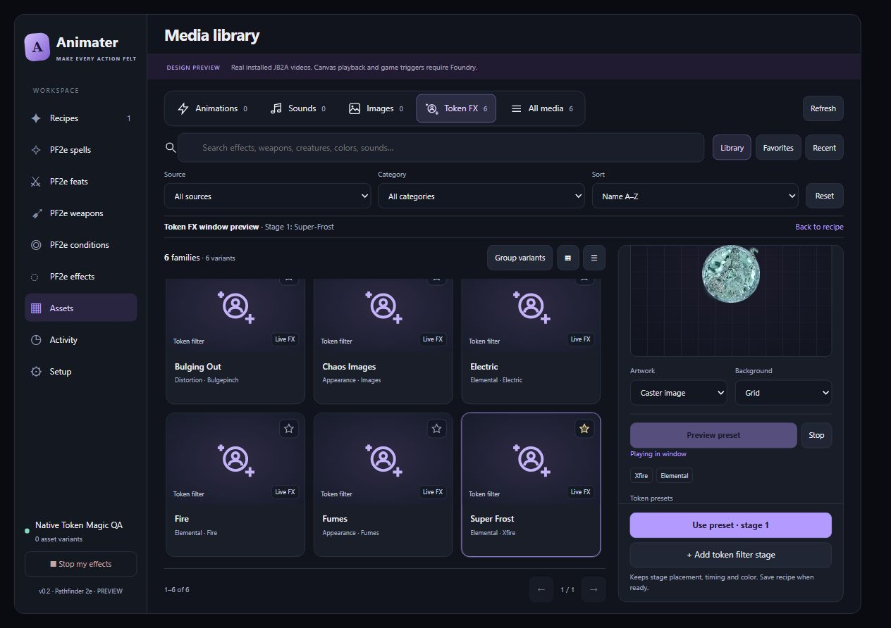

# Token Magic preview import repair

2026-10-08. Installed Token Magic FX 0.8.4.

## Failure

The production workspace imported `tokenmagic/fx/Anime.js` directly. Its import
graph reaches `module/proto/CanvasDocumentProto.js`, which requests `broadcast`
from `module/tokenmagic.js`; that loose source file does not export it. Linking
the installed graph twice with Node VM ES modules reproduced the missing-export
failure. Foundry's module manifest loads `module/bundle/tokenmagic.js` instead.

Earlier native shader QA injected an extracted clock and therefore bypassed this
production dependency. A new regression calls the real workspace host factory.
Before the repair it attempts the vendor import and fails; after the repair it
constructs and advances a dummy shader using the loaded provider.

## Repair

Remove the vendor clock import. Keep shader constructors and preset data from
the already loaded Token Magic API. `TokenFxPreviewClock` interprets preset
animation data locally, with independent elapsed time, rotation, numeric and
RGB oscillation, random values, pauses, and finite loops. Synchronized presets
use preview time. No module bootstrap, document writes, world ticker changes,
or global animation registration occur.

The QA fixture now uses the production preview clock rather than injecting the
vendor clock. Native shader sources remain installed dependencies and are not
copied into the module. Canvas-only filters retain their explicit fallback.

## Validation

- 100 tests passed across integration, clock, renderer, media library and workspace.
- Browser QA rendered installed Super-Frost, Chaos Images and Bulging Out shaders.
- Frost and image copies advanced their time uniforms; Bulging Out rendered
  copied caster artwork. No preview error or browser console error occurred.
- Stop removed the owned canvas and restored artwork. Leaving Assets released
  the renderer. The canvas backend was not called.
- Browser QA used the isolated local preview fixture, not a live Foundry world.

