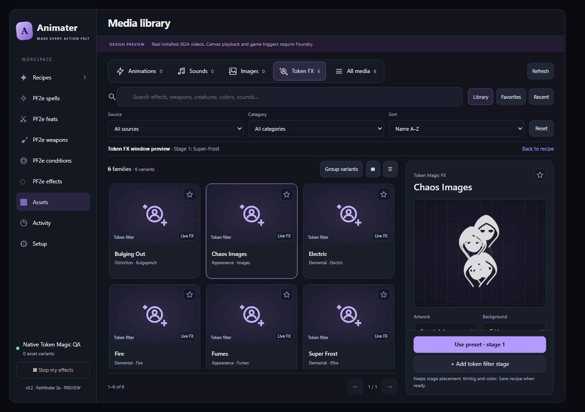
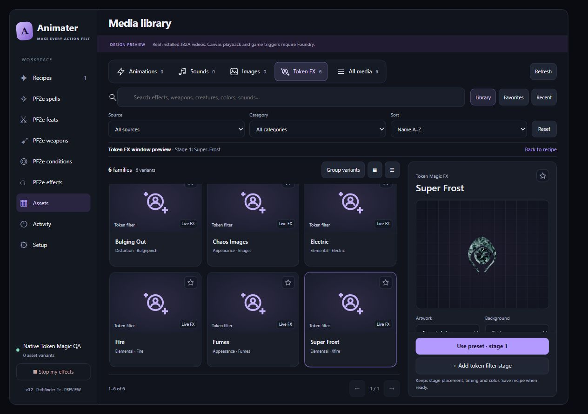

# Token Magic FX asset preview

Assets now previews a preset on sample token artwork inside the inspector using the same native shader renderer as recipe previews. Copied caster or target artwork is optional. Previewing does not call the canvas backend, change a Token document, or change the draft stage's subject.

The preview owns its filters, clock, textures and renderer. Stop, completion, switching presets, replacing artwork and leaving Assets dispose those resources. Favorites and background changes retain the active preview. Padded shader output fits inside the tile; non-square artwork keeps its proportions.

## Validation

- `node --test tests/media-library.test.mjs tests/token-fx-preview.test.mjs tests/workspace.test.mjs`: 60 passed, 0 failed.
- Browser QA used installed native Token Magic FX presets/filter constructors through `tools/token-fx-preview-fixture.mjs`, not imitation CSS effects.
- Chaos Images displayed animated copies on the sample token; Super-Frost displayed native frost; Bulging Out rendered native bulge/pinch on copied caster artwork.
- Native shader time advanced; rendered Frost and Bulging Out produced colored pixels. Sample preview recorded zero canvas backend calls.
- Stop and leaving Assets removed the preview canvas and active-artwork class. Pending preparation cancellation, favorites during playback, shader failure cleanup, padded sizing and non-square artwork are covered by tests.

This browser QA fixture exercises the production media-library and renderer without a running Foundry scene. A live-world end-to-end check was not performed this turn.

Presets requiring scene textures (`imagePath` or the `distortion` filter type) retain the existing canvas fallback. A supported bulge/pinch preset is distinct from that texture-dependent distortion filter.

