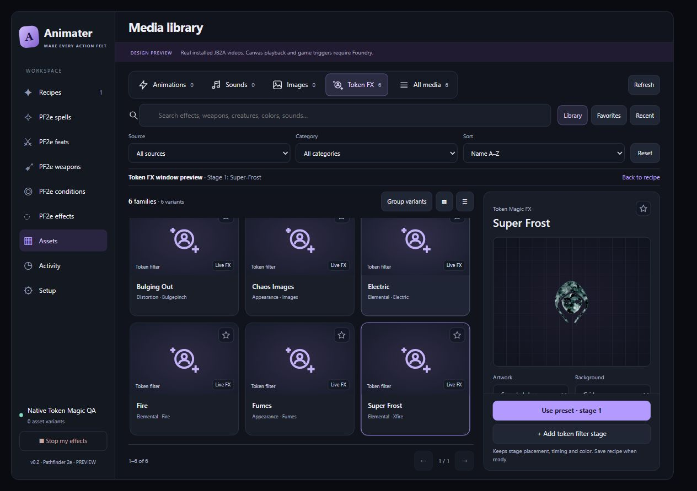
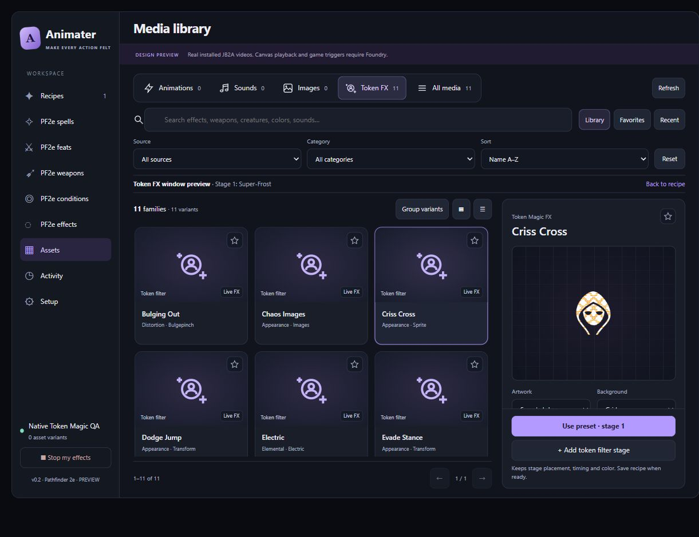

# Token Magic FX asset preview

Assets now previews a preset on sample token artwork inside the inspector using the same native shader renderer as recipe previews. Copied caster or target artwork is optional. Previewing does not call the canvas backend, change a Token document, or change the draft stage's subject.

Select a Token Magic preset card to play its window preview. Select that card again to replay. The separate Preview/Replay and Stop row has been removed. Changes to artwork, tint or duration restart the preview; duplicate input/change events do not start it twice.

The preview owns its filters, clock, textures and renderer. Cancellation, completion, switching presets, replacing artwork and leaving Assets dispose those resources. Favorites and background changes retain the active preview. Padded shader output fits inside the tile; non-square artwork keeps its proportions.

## Validation

- `node --test tests/media-library.test.mjs tests/token-fx-preview.test.mjs tests/workspace.test.mjs`: 62 passed, 0 failed.
- Browser QA used installed native Token Magic FX presets/filter constructors through `tools/token-fx-preview-fixture.mjs`, not imitation CSS effects.
- Chaos Images displayed animated copies on the sample token; Super-Frost displayed native frost; Bulging Out rendered native bulge/pinch on copied caster artwork.
- Native shader time advanced; rendered Frost and Bulging Out produced colored pixels. Sample preview recorded zero canvas backend calls.
- Card selection started Frost automatically. Switching to Chaos Images left one canvas, and changing copied artwork restarted its shader. Leaving Assets removed the preview canvas. Pending preparation cancellation, favorites during playback, shader failure cleanup, padded sizing and non-square artwork are covered by tests.

This browser QA fixture exercises the production media-library and renderer without a running Foundry scene. A live-world end-to-end check was not performed this turn.

Image-backed sprite and mask presets now buffer owned textures and bind the native sampler sprite before playback. Criss Cross displays its native gold pattern; Star Mask masks the sample artwork. Failed images release already-buffered textures. Switching cards during preparation prevents late image completion from starting a renderer. Video-backed samplers and the scene-dependent `distortion` filter retain canvas fallback.

2026-10-08 follow-up: native pixel output confirms Evade Stance moves across both axes, Saving Roll displaces/rotates/scales artwork, and Dodge Jump displaces/scales it. Criss Cross has an empty native animation map: it is a static patterned overlay, not a movement preset. Shader errors now stop the first failed frame instead of showing Playing until the preview duration expires.

The texture/movement follow-up used the same isolated fixture and production clock with installed Token Magic 0.8.4 shaders. All 108 tests across integration, clock, renderer, media library and workspace passed. Native pixel samples recorded approximately 53px horizontal / 15px vertical displacement for Evade Stance, 131px / 42px for Saving Roll and 61px vertical displacement for Dodge Jump in the padded render surface. Criss Cross produced 1,271 colored pixels. Rapid card switches and copied caster artwork retained one canvas; leaving Assets removed it. No canvas-backend calls or console errors occurred. No live-world end-to-end check was performed.

